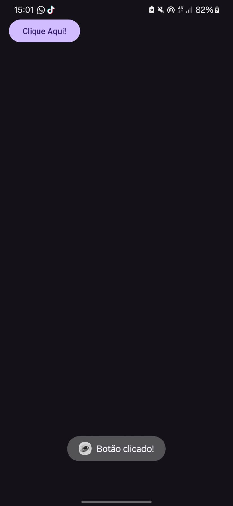

# MeuPrimeiroApp  


Este é o primeiro aplicativo Android que desenvolvi. É um app simples com apenas um botão que exibe uma mensagem ao ser clicado.

## Descrição do Aplicativo
- O aplicativo possui um botão que exibe uma mensagem na tela quando clicado.
- O ícone personalizado do aplicativo foi criado usando [IconKitchen](https://icon.kitchen/i/H4sIAAAAAAAAA6tWKkvMKU0tVrKqVkpJLMoOyUjNTVWySkvMKU6t1VHKzU8pzQHJRisl5qUU5WemKOkoZeYXA8ny1CSl2FoApT8%2BHkAAAAA%3D).
  
A ideia é melhorar o app aos poucos, adicionando novas funcionalidades, aprendendo a lógica por trás das interações e me familiarizando com as ferramentas do Android Studio.

---

## Passo 1: Configurar o Botão no Layout (activity_main.xml)

No arquivo `activity_main.xml`, adicione o seguinte código para configurar o botão:

```xml
<Button
    android:id="@+id/botaoApp" 
    android:layout_width="wrap_content" 
    android:layout_height="wrap_content"
    android:text="Clique Aqui!" />

- Explicação do Código XML:

android:id="@+id/botaoApp": Define o identificador do botão, necessário para referenciá-lo no código Java. A parte @+id/botaoApp cria uma entrada no arquivo de recursos (classe R) para o botão.

android:layout_width="wrap_content" e android:layout_height="wrap_content": Ajustam o tamanho do botão de acordo com o conteúdo inserido nele.

android:text="Clique Aqui!": Define o texto que será exibido no botão.
```

## Passo 2: Adicionar Funcionalidade ao Botão (MainActivity.java)
```
No arquivo MainActivity.java, adicione o seguinte código para associar uma ação ao clique no botão:

java
Copiar código
Button botao = findViewById(R.id.botaoApp); // Localiza o botão pelo ID definido no layout XML
botao.setOnClickListener(new View.OnClickListener() { 
    @Override
    public void onClick(View view) {
        // Exibe uma mensagem "Botão clicado!" ao pressionar o botão
        Toast.makeText(MainActivity.this, "Botão clicado!", Toast.LENGTH_SHORT).show();
    }
});

- Explicação do Código Java: 

Button botao = findViewById(R.id.botaoApp);: Cria uma variável botao do tipo Button e associa a ela o botão com o ID botaoApp definido no XML. O método findViewById localiza o botão no layout.

botao.setOnClickListener(new View.OnClickListener() {...});: Configura um ouvinte (listener) para capturar o evento de clique no botão.

View.OnClickListener(): Interface que define o método onClick para responder ao clique no botão.

Toast.makeText(...): Exibe uma mensagem temporária ("Toast") na tela, com o texto "Botão clicado!".

MainActivity.this: Define o contexto, ou seja, em qual tela a mensagem será exibida.

Toast.LENGTH_SHORT: Define a duração da exibição da mensagem (LENGTH_SHORT é a duração curta).
 ```

 